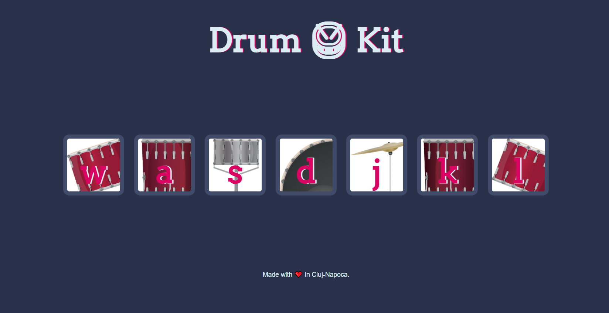

# Drum 🥁 Kit
> The Drum Kit is a beginner-nice project made with Vanilla JavaScript. 
>
> The point of this project is to build an app that runs in the browser. It allows the user to tap on the keyboard or click on a particular button and get the corresponding sound to it.

## Built with

* HTML
* CSS 
* JavaScript 
  * DOM Manipulation
  * addEventListener
   
  
## Screenshots

## Contact
[Natalia Dragutan](https://github.com/nataliadragutan).